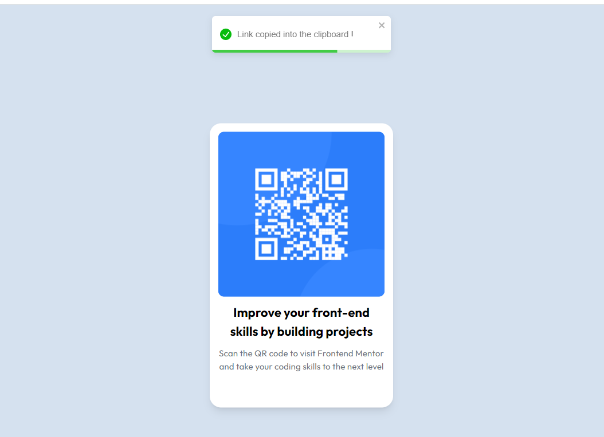

# Frontend Mentor - QR code component solution

This is a solution to the [QR code component challenge on Frontend Mentor](https://www.frontendmentor.io/challenges/qr-code-component-iux_sIO_H). Frontend Mentor challenges help you improve your coding skills by building realistic projects.

### Screenshot



### Links

- Solution URL: [https://www.frontendmentor.io/solutions/qrcode-on-react-with-copy-to-clipboard-9WbQM4pg-x](https://www.frontendmentor.io/solutions/qrcode-on-react-with-copy-to-clipboard-9WbQM4pg-x)
- Live Site URL: [https://qrcodepoc.netlify.app/](https://qrcodepoc.netlify.app/)

### What I learned

This project is a simple test using react to manipulate user clipboard data.

```js
const handleClick = async () => {
  await navigator.clipboard.writeText(url);
  // ...
};
```

### Useful resources

- [Clipboard API](https://developer.mozilla.org/en-US/docs/Web/API/Clipboard_API)
